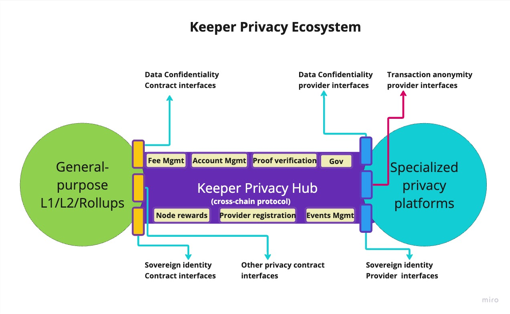
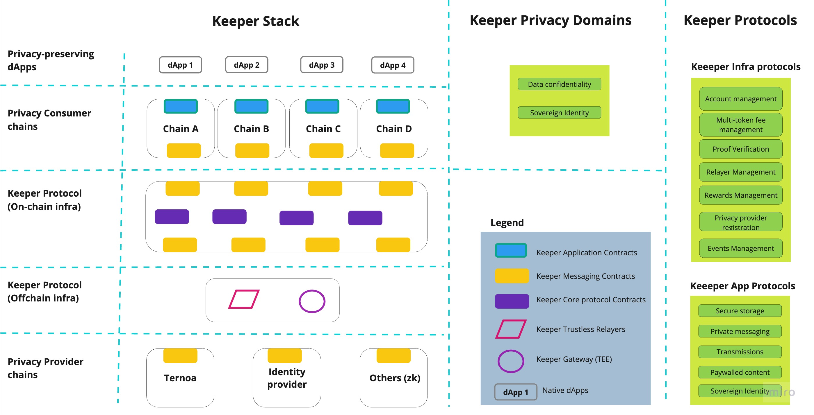
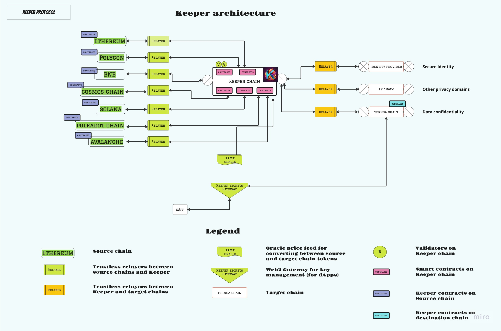
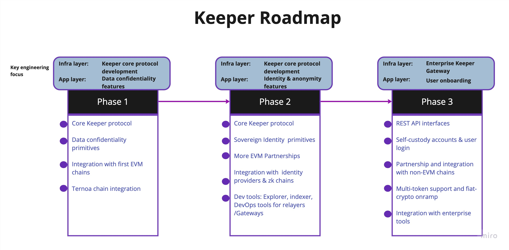

---
# 
Chain Agnostic Privacy Solutions

---

# Contents
1. [Introduction](https://github.com/keeper-protocol/litepaper#1introduction)
2. [Problem Statement](https://github.com/keeper-protocol/litepaper#2problem-statement)
3. [Vision, Mission, Goal](https://github.com/keeper-protocol/litepaper#3vision-mission-and-goal)
4. [Manifesto](https://github.com/keeper-protocol/litepaper#4manifesto)
5. [Protocol Overview](https://github.com/keeper-protocol/litepaper#5protocol-overview)
6. [Value proposition](https://github.com/keeper-protocol/litepaper#6value-proposition)
7. [Architecture](https://github.com/keeper-protocol/litepaper#7architecture)
8. [Key Security Technologies](https://github.com/keeper-protocol/litepaper#8key-security-technologies)
9. [Use Cases](https://github.com/keeper-protocol/litepaper#9use-cases)
10. [Tokenomics](https://github.com/keeper-protocol/litepaper#10tokenomics)
11. [Web3 Privacy solutions overview](https://github.com/keeper-protocol/litepaper#11web3-privacy-solutions-overview)
12. [Roadmap](https://github.com/keeper-protocol/litepaper#12roadmap)
---

# 1.Introduction
Online privacy is broken. It relies on an implicit delegation where we entrust a third-party to carry out a transaction or handle sensitive information on behalf of a user or organization. As we delve further into the digital era, this model triggers various forms of persistent threats to our online identities and sensitive data, through techniques such as phishing attacks, exchange hacks, censorship and deplatforming, posing security, privacy and access risks for our sensitive information. Protecting our data is more critical than ever, as technology is intertwined with everyday life. The key question we confront is: How can we integrate and develop technology without compromising the fundamental right to privacy?

Privacy is also a big missing piece of the puzzle in decentralized applications. Current on-chain privacy methods do not meet the necessary standards, with the ecosystem's level of transparency contributing to the problem. While transparency is an asset in certain contexts, the reality that almost all transactions on blockchains are publicly visible can result in privacy concerns. Existing solutions typically involve custom-built blockchains designed with privacy in mind, but these require users to switch entirely to a separate, specialized chain, adding to the inconvenience and complexity. These obstacles in web3 development stifle value creation and inhibit seamless integration across chains.

To address these issues, we present the Keeper Protocol, an innovative blockchain solution dedicated to making on-chain privacy technology simpler and accessible to everyone. It stands as a bridge, connecting the current state of public blockchain with a future where privacy is seamlessly integrated for users, developers, and blockchains. With our protocol, developers don't need to shift to specialized, custom solutions. Instead, they can effortlessly incorporate privacy within their current ecosystems, thereby retaining the convenience of their familiar environment while ensuring essential privacy. Keeper Protocol functions as a bridge for developers to access industry-leading privacy solutions from other specialized chains, thus safeguarding online identities, enabling developers to build hybrid applications that incorporate combinations of private and private state. 

In an increasingly digital age, data privacy has never been more essential, and Keeper is designed to address this gap.

---
# 2.Problem Statement
Keeper addresses two main problem areas:

- On-chain privacy solutions are highly specialized, siloed, fragmented and mostly infrastructure-focused, making it difficult for application developers to adopt and integrate them.
  
- There is no viable solution currently for users and businesses to securely store and access private assets/data without the involvement of intermediaries. Cloud storage providers, that are popular among users and enterprises, are highly centralized in terms of operational control and access. Users have to trust them for privacy and security of their data, and are subjected to multiple risks including data breaches, malicious insider actions, censorship and even denial of access to the services. 

---

# 3.Vision, Mission and Goal

In an increasingly digital world, our lives become intertwined with our data. Blockchain technology brings in digital assets ownership through decentralization. Keeper is about enabling decentralized privacy to make blockchain technology really suitable to users’ needs.

Keeper was created to make on-chain privacy tech simpler and accessible to everyone, and it has been designed to become the de facto privacy layer for the Top 50 dApp platforms by 2027, accelerating the development of cross-chain privacy preserving applications.

---

# 4.Manifesto
Our manifesto outlines the foundational principles to build the Keeper protocol.

**For infrastructures**, atomic composability of privacy primitives within the base chain is mandatory. Asynchronous cross-chain actions in privacy-centric use cases are needed to enable real-world scenarios.

**For privacy solution providers**, it's hard to convince dApp developers to leave their existing chain ecosystems to adopt specialized privacy tech. They need help significantly expanding their product's reach and adoption by general-purpose dApp developers on other platforms.

**For dApp builders**, embedding privacy features should not require leaving their preferred chain ecosystems (L1/L2/ Rollup/Appchain) or changing the architecture of their existing applications.

**For the community**, all codes must be open to public scrutiny, and the community must be able to actively shape the future of privacy protocols.

**For token holders**, there must be a long-term product roadmap, strong execution, meaningful partnerships, and a thriving ecosystem to ensure the project's financial viability and token value accrual.

**For web apps on the internet**, data privacy using trusted intermediaries sucks. We need a better alternative that complies with regulations and security standards.

**For businesses**, the privacy of confidential documents and information is imperative for success and survival. Businesses shouldn't need to trust tech providers or database administrators with their critical, sensitive information.

**For users**, privacy is a fundamental right. Users must be able to own and protect their private data, share & monetise content, transmit private assets, and selectively share details of their identity with no fear of hacks, leaks, losses, censorship, or being canceled.

---
# 5.Protocol Overview

Keeper is a set of innovative web3 privacy protocols, spanning the infrastructure and application layers, that aims to simplify and make on-chain privacy technology accessible to everyone. 

This protocol suite provides the technical infrastructure to establish an open cross-chain privacy ecosystem _(Figure 1.1)_, connecting providers of privacy solutions with dApp builders that lack access to native privacy features on their home chains. The Keeper infrastructure is built upon a foundation of trusted execution environment (TEE) technologies, which are highly secure cryptographic methods that offer robust security and privacy guarantees. 

_Figure 1.1 - keeper ecosystem_

In addition, Keeper provides a set of pre-built application privacy primitives that can be directly integrated into existing or new applications, drastically improving the productivity for dApp builders to build privacy-preserving apps. Keeper will initially support built-in privacy interfaces across two domains: data confidentiality and sovereign identity.

Figure 1.2 shows the layers of the Keeper stack, the privacy domains in scope and a list of the core protocols.

_Figure 1.2 - keeper stack_

Some examples of privacy features (application primitives) built into Keeper are listed below:

- **Secure Communication:** Keeper Protocol enables dApps to implement secure end-to-end encrypted messaging within their platforms, protecting private communications from interception and surveillance.
- **Personal Data Protection:** Users can securely store and transmit sensitive personal information and digital assets within the Keeper Protocol, maintaining control over their data and avoiding unauthorized access or data breaches.
- **Privacy Feature Integration:** Chain foundations and organizations managing blockchain ecosystems can easily enhance privacy features within their ecosystems by adopting the Keeper Protocol, saving time and resources.
- **Monetizing Digital Content:** Businesses and creators can securely store and sell their digital content using Keeper Protocol's paywalled content feature, ensuring only paying customers can access the content and protect copyrights from piracy.
- **Secret Storage:** Keeper Protocol's hidden storage feature provides a secure environment for storing sensitive data, such as personal information, login details, encryption keys, or secret gaming assets, ensuring privacy and security for dApps and blockchain applications.

The Keeper Protocol envisions a vibrant ecosystem consisting of general-purpose L1/L2 chains, specialized privacy solution providers and dApp developers in a mutual win-win collaboration. With its focus on user-friendly integration, chain-agnosticism, and diverse privacy features, the Keeper Protocol empowers the web3 ecosystem to enhance data privacy seamlessly.

---
# 6.Value Proposition

The three primary direct beneficiaries of the Keeper Protocol are the infrastructures of general-purpose smart contract platforms (L1/L2/Rollups), privacy solution providers (L1/L2 chains), and dApp builders. However, the biggest beneficiaries would be the end-users of the applications that integrate the Keeper protocol, who can own, store, share, monetize, and transfer their private data and assets in a secure, trustless manner.

For infrastructures, the Keeper Protocol allows any chain to become a privacy provider for the dApp builders in their ecosystem. This significantly expands the range of applications that can be built on the chain, creating value and driving demand for the native token. Without this infrastructure, general-purpose smart-contract chains (L1, L2, Rollup, or Appchain) would need to build their own privacy infrastructure, resulting in redundant efforts, incompatibility with other chains due to differing implementations, and high costs for chain foundations to develop and maintain this component.

For dApp builders, the Keeper Protocol simplifies the process by enabling them to choose from a set of pre-defined Keeper privacy primitives. These primitives are implemented as smart contracts on their preferred chain and can be composed in a permissionless manner into their applications. Without this infrastructure, dApp builders would need to leave their existing chain ecosystems to access privacy features and/or learn new technologies or programming languages. Keeper also allows dApp developers to switch between various backend privacy providers (e.g., different identity providers) while minimizing app changes. Keeper helps developers build hybrid applications with a mix of public and private state.

For privacy solution providers (such as a platform that offers secure key management using TEEs or a decentralized identity issuing chain), Keeper enables their products to be accessed by a larger set of developers on other chains, thus increasing the developers using their product to build applications, and the associated increase in fees collected and transaction volumes for their product portfolio.

---
# 7.Architecture

Keeper is built as a suite of cross-chain web3 protocols that are designed for trustless computation, privacy and developer experience at their core. 

Trustless computation is enabled through a series of smart contracts deployed on a highly decentralized computing infrastructure. 

Privacy is enabled through use of technologies such as Trusted execution environments, Verifiable secret sharing and Zero-Knowledge proofs. 

Developer experience is enabled through design of standardized interfaces for privacy features available on multiple chains, abstracting away details of underlying tech platforms and handling the complexities of cross-chain messaging, multi-token fee management, account mapping and generation of transaction and storage proofs by trustless relayers, with proof verification done on-chain. 

_Figure 1.3 - overview of the Keeper architecture._

Let's break down the different components of the Keeper Protocol architecture:

### Source Chain
This refers to the blockchain network from which the request originates from. It could be any L1/L2/Rollup/App chain. It is the chain on which dApp developers build their applications.

### Keeper Chain
This is the blockchain network that serves as technical infrastructure for the core Keeper Protocol. It hosts the keeper contracts, specialized smart contracts responsible for enforcing rules, and maintaining the protocol's security. Keeper also performs the management of token swaps, proportional distribution of fees collected to the target chains, and computation of rewards for the offchain infrastructure such as relayers and gateways.

### Relayers
Trustless relayers form an important part of the architecture. They act as intermediaries between the source chain and the Keeper chain, as well as between the Keeper chain and the target chain. They ensure the smooth and secure transfer of assets and data across different chains. They are trustless entities, and generate proof of transactions that are verified by the Keeper protocol contracts on-chain.

### Target Chain 
Refers to the providers of specialized privacy solutions. Target chains register with Keeper to enable access to their platform to developers from Source chains.

### Oracle
Oracles provide price feeds that allow for the conversion of tokens between the source and target chains. Keeper supports the payment of fees for transactions in multiple cryptocurrencies. Oracles enable seamless asset exchange and ensure frictionless and fair fee management for all the players in the ecosystem.

### Gateway
The Web2 Gateway is an off-chain component that serves as a key management system for decentralized applications (dApps). It provides secure access to user keys and enables smooth interactions with the Keeper Protocol.

The Keeper Protocol architecture leverages the power of multiple blockchain networks to enable sophisticated privacy use cases spanning multiple chains.

By integrating these architectural components, Keeper Protocol seeks to address the data privacy challenges currently faced in the blockchain and web3 space. The Keeper Protocol is an innovative solution engineered to protect users' data. By leveraging advanced cryptographic algorithms and smart contract technology, it empowers users to execute NFT transfers and share data privately. This technology enhances interoperability through its distinct chain-agnostic feature, broadening its accessibility for both developers and blockchains. Key to the protocol's utility is a suite of pre-built privacy features, including secret storage, secure messaging, paywalled content, and sovereign identity. This assortment not only simplifies the task of integrating privacy technologies into dApps but also places less burden on the developers.

Keeper Protocol's comprehensive approach to data privacy and security paves the way for a more secure and privacy-focused web3 ecosystem. By making on-chain privacy technology user-friendly and widely accessible, the protocol empowers web3 users to uphold their privacy rights without sacrificing the pace of innovation and technological advancements. By simplifying on-chain privacy technology and making it accessible to everyone, Keeper Protocol lays the foundation for dApps and blockchains to prioritize data privacy without compromising innovation and technological advancements.

---
# 8.Key security technologies

Keeper uses a suite of security and privacy technologies including Trusted execution environments (TEE) , secure and distributed key management algorithms such as Verifiable Secret Sharing, and Zero knowledge proofs for private state and anonymity.

Trusted Execution Environments (TEEs) are secure enclaves that provide a protected environment for executing code and processing sensitive data. They are designed to ensure the confidentiality, integrity, and isolation of computations. One of the key techniques used in TEEs is remote attestation. Remote attestation is a cryptographic protocol used to verify the integrity and configuration of a remote TEE. It enables a third-party, called the verifier, to verify the integrity of a TEE and the code/data running inside it, without having direct access to the TEE. Remote attestation typically involves the use of cryptographic algorithms such as hash functions, digital signatures, and public key cryptography. The remote attestation protocol involves the use of hash functions, digital signatures, and public-private key pairs. The TEE generates a signature by signing a nonce concatenated with the measurement of its state. The Verifier receives this signed message, verifies the signature, and performs checks to ensure the TEE's integrity and trustworthiness

Here is an outline of the mathematical basis for remote attestation:

### Hash Function:
$H(m)$: Represents the hash function applied to a message $m$. It produces a fixed-size output, often represented as a hash value or digest.

### Digital Signatures:
Key Generation: Generate a public-private key pair: 
  $(pk, sk)$

Signing:Sign a message $m$ with the private key sk: 
  $σ = sign(sk, m)$

Verification:Verify the signature $σ$ of a message $m$ using the public key pk: 
  $verify(pk, m, σ) -> \\{true, false\\}$

### Remote Attestation Protocol Steps:
#### TEE Side:

1. Generate an attestation key pair:

    $(pkATTEST, skATTEST)$

2. Generate a nonce:

    $N$

3. Compute the measurement of the TEE's state: 

    $M = H(TEEstate)$

4. Sign the concatenation of the nonce and measurement: 

    $σATTEST = sign(skATTEST, N || M)$

5. Send the signed nonce and measurement to the Verifier.

#### Verifier Side:
1. Receive the signed nonce and measurement from the TEE.
   
2. Verify the attestation signature using the attestation public key:

    $pkATTEST$

3. Compare the received measurement with the expected measurement.
   
4. Optionally, check if the attestation key used by the TEE is trusted (e.g., by verifying its digital certificate).
   
5. Accept the attestation if all verification checks pass.

Shamir's Secret Sharing is a cryptographic algorithm that allows a secret to be divided into multiple shares, which can then be distributed to different participants. The original secret can only be reconstructed when a sufficient number of shares beyond a specific threshold are combined together. Verifiable Secret Sharing (VSS) is a cryptographic protocol that extends the concept of Shamir's Secret Sharing by providing a means to verify the correctness of the shares distributed among participants. It ensures that the shares are valid and consistent with the original secret. Details of the mathematical basis for VSS are outlined below:

### Finite Fields
VSS relies on finite fields, denoted as $GF(p)$, where p is a prime number. A finite field consists of p elements and follows specific mathematical rules for addition, subtraction, multiplication, and division.
 
### Polynomial Generation
Similar to Shamir's Secret Sharing, VSS starts by generating a polynomial of degree $k-1$, where $k$ is the minimum number of shares required for secret reconstruction. The polynomial is defined as:

$P(x) = a0 + a1x + a2x^2 + ... + ak-1x ^{(k-1)}$

The coefficients $a0, a1, ..., ak-1$ are randomly chosen from the finite field $GF(p)$, and $a0$ represents the secret to be shared.

### Share Distribution
In VSS, each participant is assigned a unique x-coordinate, similar to Shamir's Secret Sharing. The share $yi$ for participant $i$ is calculated by evaluating the polynomial at $xi$:

$yi = P(xi)$

However, in VSS, the shares are computed in such a way that they can be verified by other participants.

### Commitment Phase
Before sharing the actual shares, VSS introduces a commitment phase. In this phase, the dealer, who generates the secret and shares, commits to the polynomial coefficients without revealing them. This commitment is typically achieved using cryptographic techniques such as Pedersen commitments or cryptographic hash functions.

### Verification Phase
After receiving their shares, participants can engage in a verification phase to ensure the integrity and validity of the shares. Verification involves two steps:

  a. Checking Polynomial Consistency: Participants can use their shares, along with the shares of other participants, to reconstruct the polynomial. By comparing their reconstructed polynomial with the polynomial commitment made during the commitment phase, participants can verify if the shares are consistent with the original polynomial.

  b. Checking Share Validity: Participants can verify the correctness of their own shares by checking if they are consistent with the reconstructed polynomial. This step ensures that no malicious dealer has tampered with the shares or distributed incorrect values.

### Secret Reconstruction
To reconstruct the secret, a minimum number of valid shares, usually $k$, are required. Participants can combine their valid shares using interpolation techniques, such as Lagrange interpolation, similar to Shamir's Secret Sharing. Once a sufficient number of valid shares are collected, the original secret can be reconstructed.

By incorporating the verification phase, Verifiable Secret Sharing enhances the security and trustworthiness of the shared secret. It allows participants to detect any malicious behavior, guaranteeing the correctness of the shares and maintaining the privacy and integrity of the secret.

---

# 9.Use Cases

### Secure Communication 
In a world where private communications are susceptible to interception and surveillance, secure messaging is crucial. Keeper Protocol provides a way for dApps to implement secure, end-to-end encrypted messaging within their platforms. In a gaming dApp players often need to communicate with each other for various reasons, such as coordinating strategies, negotiating trades, or forming alliances. However, traditional messaging systems can pose privacy and security risks, as they may be susceptible to interception, surveillance, or unauthorized access. Keeper Protocol enables end-to-end encrypted communication between players, ensuring privacy and preventing interception or unauthorized access. 
 
### Digital Asset Management for dApp developers
dApp developers often struggle with privacy issues when handling sensitive digital assets. The Keeper Protocol can provide a secure, private, and efficient environment for the storage, transmission, and management of these assets. Developers can integrate the Keeper Protocol into their existing infrastructure without switching to a different ecosystem. 

>Time Guardian is a decentralized dApp designed for users to securely transmit their digital legacies, including NFTs, cryptocurrencies, and estate plans, to future generations. The app utilizes encrypted time capsules, available only at a predefined date, to hold these digital assets. The Keeper Protocol, with its secret storage feature, is employed to safeguard the private keys essential for the transfer of asset ownership, ensuring complete encryption and privacy until the transfer date. Upon reaching the set date, the decryption keys are securely transmitted to the recipients using Keeper Protocol's secure messaging function, enabling secure access to the time capsules and a smooth transfer of the digital assets.

### Personal Data Protection for users 
The Keeper Protocol can provide much-needed security and privacy for their sensitive personal information and digital assets. Users can store their personal credentials, financial documents, and other sensitive data within the secure environment provided by the Keeper Protocol. They can also securely transmit these assets to their next of kin or other authorized recipients without fear of unauthorized access or data breaches. 

### Monetizing Digital Content
In traditional online platforms, content creators depend on the platform's algorithm and policies for their content's visibility and monetization. The platform takes a significant cut from the creators' earnings as fees. Businesses and creators can use Keeper Protocol to store and sell their digital content securely. Through the protocol, they can ensure that only paying customers get access to the content, therefore maintaining their copyrights and protecting it from piracy. 

---

# 10.Tokenomics

### Utility
The Keeper token($KEEP) will be used for three purposes: 
- Transaction fees
- Node operator rewards
- On-chain governance

### Supply
$KEEP is the first trigger-based inflationary token. Because Keeper's use is bound to grow as it becomes available to more and more builders on generalist chains, additional $KEEP will be minted depending upon adoption of Keeper.

New $KEEP issuances will be decided by governance, subject to community approvals. However, they will be limited based on following factors:
- No additional issuances can be decided before at least 5 top 50 generalist protocols have been integrated to keeper,
- Annual average inflation rate since TGE shall not exceed 5% after each new issuance,
- Each new issuance can not exceed 10% of initial $KEEP total supply.

Initial Supply: 240m $KEEP

---

# 11.Web3 privacy solutions overview
As the digital era unfolds, privacy-preserving blockchain technologies are crucial. Contributors to privacy-focused data include Secret Network, Aztec Protocol, Zcash, Monero, StealthEX, and Oasis Network, and initiatives within the Bitcoin ecosystem are all shaping this space, each with unique strategies. Secret Network and Aztec Protocol leverage zk-SNARKs, a cryptographic method that confirms data possession without revealing the data itself. Secret Network's strategy involves creating a standalone privacy-centric platform, whereas Aztec Protocol implements a privacy layer onto Ethereum's existing dApps. Zcash and Monero, renowned privacy-focused cryptocurrencies, employ zk-SNARKs and ring signatures to conceal data details.

Meanwhile, StealthEX is a cryptocurrency exchange specializing in privacy coins, and Oasis Network is a privacy-centric blockchain platform that utilizes zk-Rollups for data privacy. These entities share a common mission: advocating for privacy rights in the digital sphere and countering unwarranted surveillance and financial censorship.

The demand for secure and private blockchain data has led to an expanding market for privacy protocols. Keeper Protocol differentiates itself from the ecosystem with cross-chain compatibility and an easy integration process for dApps, targeting both chain foundations and dApp developers. Unlike Secret Network and Aztec Protocol, which concentrate primarily on transactional privacy, Keeper Protocol aspires to offer a comprehensive range of privacy-preserving features.

Keeper Protocol's primary edge lies in its innovative use of TEE and ZK. These technologies are renowned for enhancing privacy while maintaining security measures, enabling the protocol to provide highly secure and private services. The wide range of privacy services offered, such as secure messaging, paywalled content, and digital identity management, goes beyond transactional privacy, demonstrating an innovative approach to privacy solutions within the blockchain industry. The increasing trend of blockchain adoption worldwide is expected to fuel the growth of the privacy protocol market. In addition, the heightened scrutiny of regulatory bodies towards privacy aspects of blockchain technology underscores the need for effective privacy protocols, presenting potential growth opportunities for solutions like Keeper Protocol. 

---

# 12.Roadmap

_Figure 1.4 - roadmap_

---
